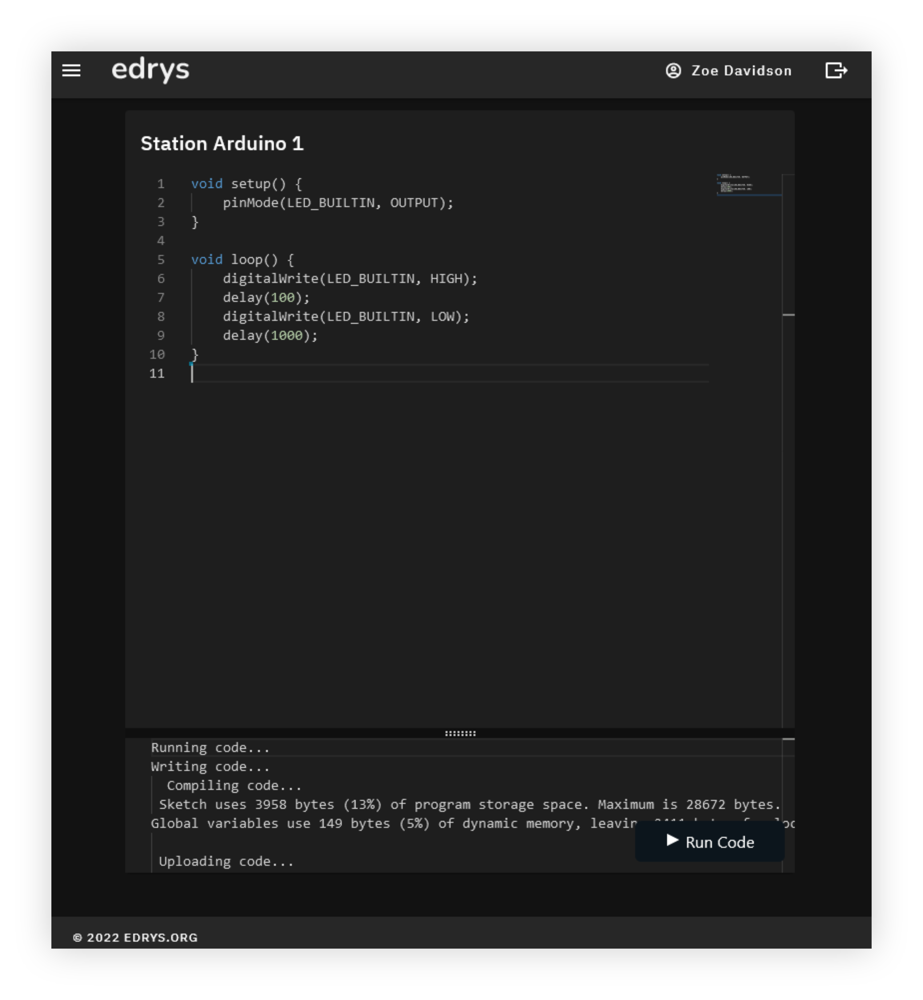

# Edrys Code Editor Module

This module allows teachers and students to collaborate over some code and "run" it in some form. It is meant to be used with stations, where commands are going to be run using the [the Command Runner Agent](https://github.com/edrys-org/agent-command-runner), for example to upload code to an embedded device or run it on locally and return the result.


## Usage

Use this URL to add the module to your class:

```
https://edrys-org.github.io/module-code/
```

You may specify the following config:

```js
{
  "language": "cpp" // or any langauge from https://microsoft.github.io/monaco-editor/
}
```

Next, set up [the Command Runner Agent](https://github.com/edrys-org/agent-command-runner) on your station(s) to allow the module to run commands when the code is run. On the station device, you will be able to specify what commands will be run when students or teachers run the code. Every station has its own set of commands saved (they will be saved locally on each station).

The module will silently fail if the agent is not locally running in the station device (expected to be on the default port `8585`).

### Configuration

You may optionally specify any of the following module config:

```json
{
    "editorText": "Starting text in editor...",
    "terminalText": "Starting text in terminal...",
    "commands": "Default commands",
    "language": "cpp",
    "theme": "light"
}
```

## Arduino example

Below is an exmaple where this module is used to allow students to upload code to a live Arduino station.

This is what students and teachers see in the station, where the top section is the code editor, and the bottom section is a terminal showing command output when the code is run (note dark theme is pictured):
<div align="center">

</div>

When visiting the module on the station device itself, you will also be able to customize what commands will be run for that module (using `$CODE` in the commands to substitue for the submitted code):
<div align="center">

</div>

Arduino CLI is set up manually beforehand on station devices.